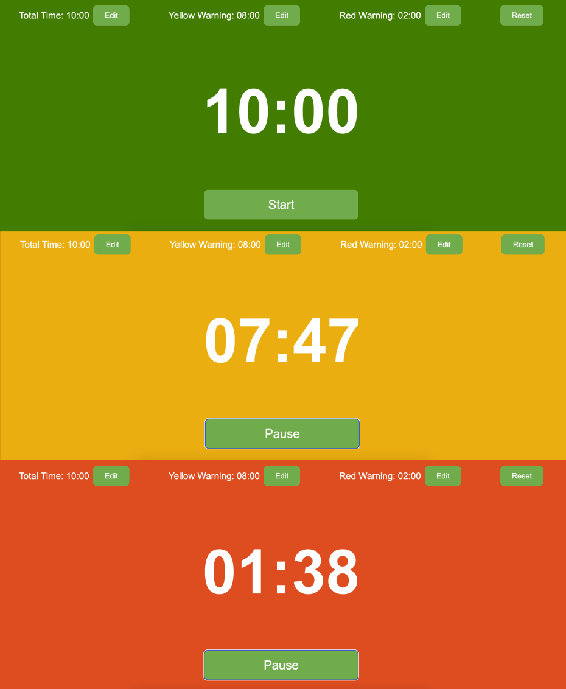
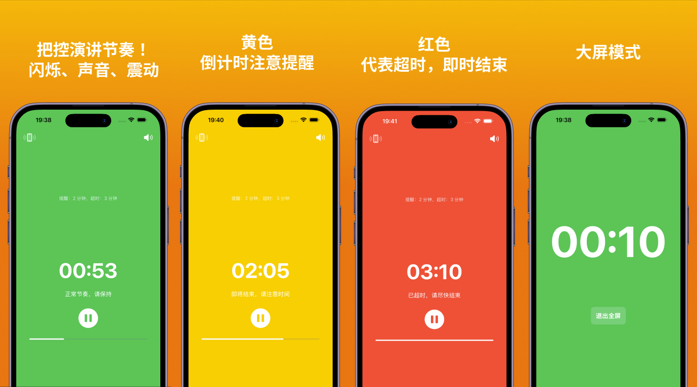

# PaceTimer Web

PaceTimer Web 是一个专为演讲、演示或其他需要严格时间控制的场合设计的计时器应用。它通过**红、黄、绿三种颜色**快速提醒你剩余时间，帮助你更好地掌控节奏。

👉 **[点击这里直接访问](https://sy1995.github.io/Pacetimer/)**

- **iOS 应用链接** [点此访问](https://apps.apple.com/us/app/%E8%8A%82%E5%A5%8F%E8%AE%A1%E6%97%B6/id6740053131?l=zh-Hans-CN)

[English Version](./README_EN.md) 

## 功能特性

- **颜色提醒**：
  - **绿色**：时间充足，可以放心进行。
  - **黄色**：时间即将结束，请注意节奏。
  - **红色**：时间紧迫，需要尽快结束。

- **倒计时模式**：
  - 从设定的总时间开始递减，适合严格控制时间的场景。
  - 支持自定义总时间、黄色警告时间和红色警告时间。

- **简单易用**：
  - 一键开始/暂停，一键重置。
  - 通过颜色变化直观提醒，无需频繁查看时间。

- **iOS 应用支持**
  - 支持 Apple Watch，让你在电脑投屏时，通过手机或手表接收提醒。
  - 更多功能尽在 iOS 应用，敬请期待！

## 如何使用

1. 打开 [PaceTimer Web](https://sy1995.github.io/Pacetimer/)。
2. 根据需要设置总时间、黄色警告时间和红色警告时间。
3. 点击“Start”按钮开始计时，点击“Pause”按钮暂停计时。
4. 使用“Reset”按钮重置计时器。

## 示例

## 支持我

如果你觉得这个项目对你有帮助，欢迎通过购买 iOS 应用支持我！你的支持是我持续改进和开发的动力。

---

## 许可证

本项目基于 [MIT 许可证](LICENSE) 开源。

---

## 贡献

欢迎提交 Issue 或 Pull Request 来改进本项目！

[English Version](./README_EN.md)